# <div align="center"> **🛒 E-commerce Log 기반 이탈 예측 모델링** </div>
---
> **🛒 전자상거래 로그 기반 고객 이탈 예측 및 타겟팅 최적화 모델링**  
<div align="center"></div>


## 👥 팀 소개 
### ✦ 팀 명 : **서거니와 아이들 시즌2**

<table style="width: 100%; table-layout: fixed; border-collapse: collapse; text-align: center; font-size: 14px;">
  <tr>
    <td style="width: 20%; border: 1px solid #ddd; padding: 10px; vertical-align: middle;">
      
    </td>
    <td style="width: 20%; border: 1px solid #ddd; padding: 10px; vertical-align: middle;">
      
    </td>
    <td style="width: 20%; border: 1px solid #ddd; padding: 10px; vertical-align: middle;">
      
    </td>
    <td style="width: 20%; border: 1px solid #ddd; padding: 10px; vertical-align: middle;">
      
    </td>
    <td style="width: 20%; border: 1px solid #ddd; padding: 10px; vertical-align: middle;">
      
    </td>
  </tr>
  <tr style="background-color: #f9f9f9; font-weight: bold;">
    <td style="border: 1px solid #ddd; padding: 8px;">정석원</td>
    <td style="border: 1px solid #ddd; padding: 8px;">김다빈</td>
    <td style="border: 1px solid #ddd; padding: 8px;">김지우</td>
    <td style="border: 1px solid #ddd; padding: 8px;">송주엽</td>
    <td style="border: 1px solid #ddd; padding: 8px;">신승훈</td>
  </tr>
  <tr>
    <td style="border: 1px solid #ddd; padding: 8px; color: #555; word-break: keep-all;"><strong>팀장</strong>/PM/ML</td>
    <td style="border: 1px solid #ddd; padding: 8px; color: #555; word-break: keep-all;"><strong>팀원</strong>/DL</td>
    <td style="border: 1px solid #ddd; padding: 8px; color: #555; word-break: keep-all;"><strong>팀원</strong>/ML</td>
    <td style="border: 1px solid #ddd; padding: 8px; color: #555; word-break: keep-all;"><strong>팀원</strong>/ML</td>
    <td style="border: 1px solid #ddd; padding: 8px; color: #555; word-break: keep-all;"><strong>팀원</strong>/DL</td>
  </tr>

  <tr style="text-align: left; vertical-align: top; font-size: 13px;">
    <td style="border: 1px solid #ddd; padding: 10px; word-wrap: break-word;">
      • 프로젝트 총괄(PM)<br>
      • 문제정의/라벨/스플릿 설계<br>
      • 공통 지표/리더보드 운영<br>
      • 최종 발표
    </td>
    <td style="border: 1px solid #ddd; padding: 10px; word-wrap: break-word;">
      • DL 파이프라인 고도화<br>
      • Streamlit 대시보드 보조<br>
      • CSS 디자인 개선
    </td>
    <td style="border: 1px solid #ddd; padding: 10px; word-wrap: break-word;">
      • Streamlit 웹 앱 전담 개발<br>
      • 대시보드 아키텍처 설계<br>
      • 시각화 및 인터랙션 구현
    </td>
    <td style="border: 1px solid #ddd; padding: 10px; word-wrap: break-word;">
      • 코드 모듈화 및 구조 개선<br>
      • 추론 파이프라인 연동<br>(.pt/.pkl ↔ 서비스)<br>
      • 시스템 최적화
    </td>
    <td style="border: 1px solid #ddd; padding: 10px; word-wrap: break-word;">
      • FAQ 기획 및 구현<br>
      • 리포트 다운로드 기능 개발<br>
      • 대표 이탈 케이스 분석
    </td>
  </tr>
</table>

<br><br>

## 📄 프로젝트 개요 (Overview)

### ✦ 프로젝트명
> 🛒 전자상거래 로그 기반 고객 이탈 예측 및 타겟팅 최적화 모델링

### ✦ 프로젝트 기간
> 2026.01.14(수) ~ 2026.01.15(목)


### ✦ 프로젝트 소개
본 프로젝트는 약 378만 건의 전자상거래 이벤트 로그를 기반으로,
특정 시점(Anchor Time)을 기준으로 유저 행동 패턴을 학습하고,
향후 30일 이내 휴면(m2) 전환 가능성을 예측하는 모델을 구축합니다.

## 💾 Data Source
이 프로젝트는 Kaggle의 이커머스 행동 데이터를 기반으로 합니다.

[](https://www.kaggle.com/datasets/mkechinov/ecommerce-behavior-data-from-multi-category-store)

또한 본 프로젝트는 단순 모델 성능 경쟁이 아니라
 - 시점 기반 데이터 누수(Data Leakage) 차단
 - Time Split 기반의 실무형 검증 시나리오
 - Top-K(예: 상위 5%) 타겟팅을 전제로 한 평가 체계

를 파이프라인으로 구현하는 데 초점을 둡니다.

<br><br>

### ✦ 프로젝트 필요성 (배경)

**1. 신뢰 이슈가 “리텐션”에 직접 영향**  
국내 이커머스는 가격/배송 경쟁뿐 아니라, 보안·CS·고객경험 같은 ‘신뢰’ 요인이 이용자 유지에 직접적인 영향을 줍니다.
실제로 2025년 11월 말, 쿠팡의 대규모 개인정보 유출(33.7M 계정 규모로 보도) 이슈 이후 이용자 이탈을 뜻하는 ‘탈팡’ 담론이 확산되었고, DAU 변동 및 규제·조사 이슈 등 시장 리스크가 연이어 보도되었습니다

**2. Rule-based 마케팅의 한계**  
“최근 n일 미접속” 같은 규칙은 이미 늦은 사후 대응이 되기 쉽습니다.
로그 기반 행동 패턴에서 이탈 징후를 사전에 포착하여 선제 대응할 수 있는 모델이 필요합니다.

**3. 데이터 기반의 핀셋 타겟팅**  
현실적으로 모든 고객에게 쿠폰/혜택을 제공할 수 없습니다.
따라서 우리는 휴면 확률이 높은 상위 K% 고객을 선별하여 쿠폰을 제공함으로써, 마케팅 비용을 효율적으로 사용하고 리텐션 효과를 극대화하는 운영 시나리오를 가정합니다.

<br><br>

## 💼 비즈니스 이해 (Business Understanding)

### ✦ 이탈(휴면) 정의(라벨)
- **m2(휴면)**: *(예시)* Anchor 시점(t) 이후 **H=30일 동안 접속/장바구니/구매 이벤트가 0회**이면 휴면으로 정의한다.  


### ✦ 타겟팅 가정 (Operational Targeting)
- 운영 제약: 마케팅 예산/인력으로 인해 **상위 K% 고위험 고객만 케어 가능**

### ✦ 휴면이 이탈인가?
- 본 프로젝트에서 **이탈(Churn)**은 서비스 해지처럼 명시적 이벤트가 존재하지 않는 이커머스 환경을 고려하여, 향후 H일 동안 핵심 활동이 없는 휴면(Dormant)을 이탈의 대체 **지표(proxy)**로 정의하였다. 이는 마케팅 운영 관점에서 **되돌릴 수 있는 이탈 위험군**을 선별하기 위한 설정이다.

<br><br>

## 📏 평가 지표 및 선택 이유 (Metrics & Rationale)

본 프로젝트의 운영 목표는 **휴면상위 K% 고객에게만 쿠폰/케어를 수행**하는 것이다.  
따라서 임계값(0.5) 기반 지표보다 **Top-K 타겟팅 성과**를 직접 측정하는 지표를 우선한다.

### ✦ Main KPI (Primary)
- **Lift@K**: 랜덤 타겟팅 대비 **몇 배 효율적인지**를 직관적으로 보여주는 실무 지표  
  - Lift@K = Precision@K / Prevalence(전체 휴면 비율)

### ✦ Secondary KPI
- **Precision@K**: 상위 K% 타겟의 “순도” (쿠폰 낭비 최소화)
- **Recall@K**: 전체 휴면 중 상위 K%가 커버한 비율 (커버리지)

### ✦ Diagnostic / 참고 지표
- **PR-AUC(AP)**: threshold를 변화시키며 Precision–Recall trade-off를 요약한 지표로,  
  모델의 전반적인 랭킹 품질을 점검하는 용도로 활용한다.

> Note: 본 프로젝트는 “Top-K 운영”이므로, 모델 선택은 Lift@K/Precision@K를 우선하고 PR-AUC는 보조로 사용한다.

<br><br>

## 📄   프로젝트 목표

**1. 문제의 실무적 재정의 (Practical Problem Definition)**
복잡한 다중 분류 대신, 실제 마케팅 액션(쿠폰 발송 등)이 가능한 **휴면(m2) 여부 이진 분류**로 문제를 단순화하여 실용성을 높였습니다.

**2. 비즈니스 중심의 평가지표 (Business-Aligned Metrics)**  
운영 시나리오가 **“상위 K%만 타겟”**이므로, 임계값(예: 0.5) 기반 지표만으로는 부족합니다.  
따라서 랭킹 기반 지표를 사용합니다.  
- PR-AUC(AP): PR 곡선의 요약(Threshold-free)
- Precision@TopK(%) / Recall@TopK(%): 상위 K%의 타겟팅 품질
- Lift@TopK(%): 랜덤 대비 효율(타겟팅 모델의 실무 지표)

**3. 재현 가능한 파이프라인 (Reproducible Pipeline)**
- 모든 모델이 동일한 Anchor/Label/Split을 공유하도록 표준화
- Time Split로 Look-ahead(미래 정보) 누수 위험 최소화
- 아티팩트(모델/스케일러/피처 순서/평가 결과)를 표준 디렉토리에 저장


## 📂 프로젝트 설계 
```
📦 SKN23-2nd-3Team/
├── data/
│   ├── raw/
│   │   └── *.parquet
│   └── processed/
│       └── *.parquet
│
├── app/
│   ├── *.py
│   ├── pages/
│   │   └── *.py
│   └── utils/
│       └── *.py
│
├── models/
│   ├── *.py
│   ├── configs/
│   │   └── ...
│   ├── dl/
│   │   └── ...
│   ├── eval/
│   │   └── *.json
│   ├── preprocessing/
│   │   └── *.py
│   └── trained_model/
│       └── ...
│
├── reports/
│   ├── preprocessing/
│   │   └── *.json
│   ├── training/
│   │   └── *.md
│   └── insights/
│       └── *.md
│
├── assets/
│   ├── images/
│   │   └── *.png
│   ├── eda/
│   │   └── *.png
│   ├── training/
│   │   └── ...
│   └── ui/
│       └── ...
│
└── notebooks/
    ├── ml/
    │   └── *.ipynb
    └── dl/
        └── *.ipynb

📁 README.md
📁 requirements.txt
📁 .gitignore

```

<br><br>
## 📄   프로젝트 내용
### 데이터셋 (Dataset)
**1. 데이터 정의**
- 기간: 7개월 이커머스 로그
- 대상: watch 카테고리
- 브랜드: samsung / apple / xiaomi
- 데이터 형태: 대용량 이벤트/거래 로그 기반의 사용자 단위 예측
- train(11~1월)/val(2월)/test(3월)로 학습/검증/테스트로 나눠서 진행

| 상세 라벨 분포<br>(m0: 정상 / m1: 스위치 / m2: 휴면) | 휴면 비율<br>(m2 / m0+m1) |
| :--: | :--: |
| <div align="center">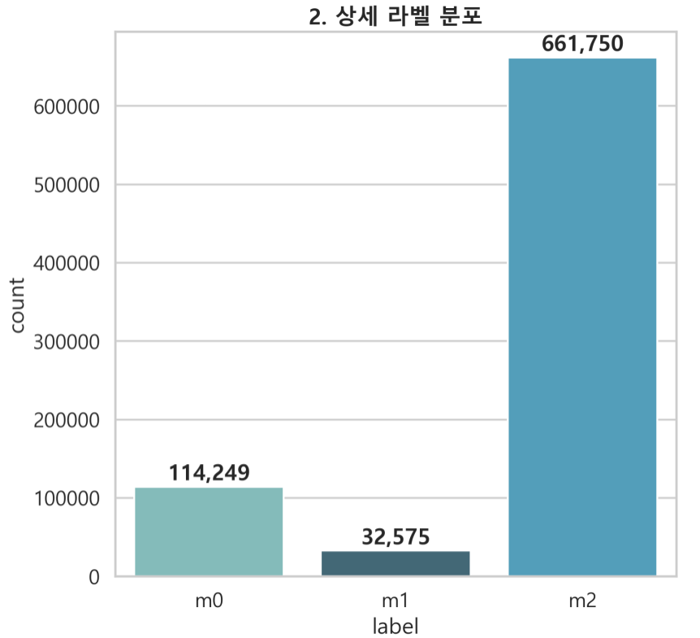</div> | <div align="center">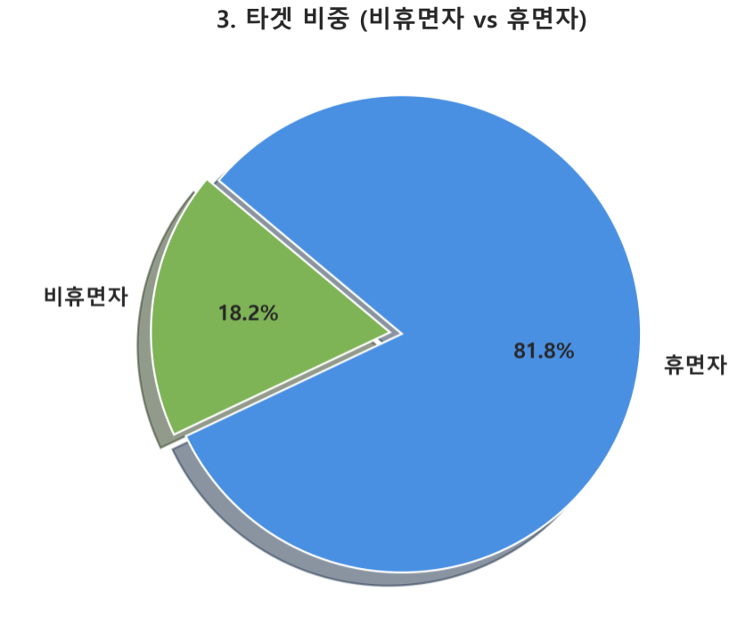</div> |

**2 제거/제외 컬럼(또는 후보) & 이유**
-  `home_brand`, `future_brand`  
  → **라벨 이후 정보가 포함될 가능성(미래 정보/사후 정보)**
  → **train/val/test 경계를 침범할 가능성 -> 데이터 누수확률 증가**
<div align="center">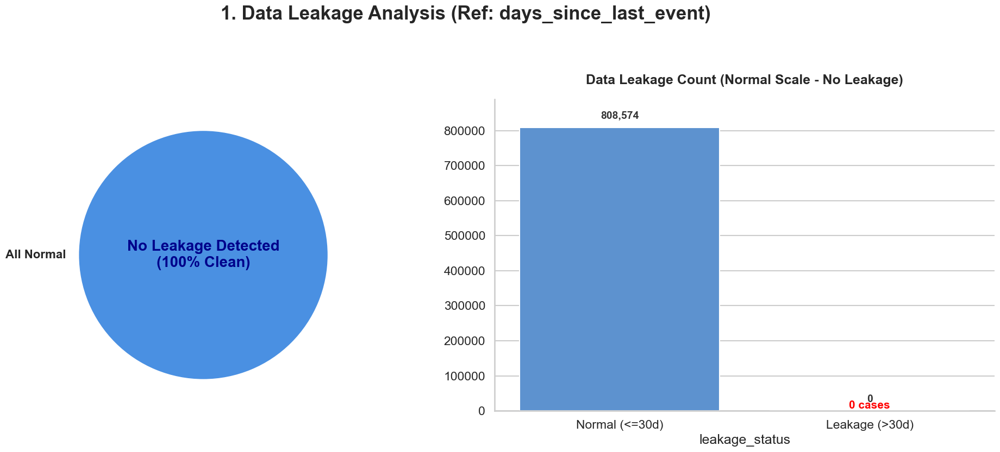</div>

**3 집계 기간(윈도우W)**
- 과거 W=30일: **[t-30, t]** 구간만 사용
- 미래 H=30일: **(t, t+30]** 구간으로 라벨 산출
- 원칙: **event_time < anchor_time** 조건을 만족하는 데이터만 피처 생성에 사용

**4 파생변수 목록**
- Recency(경과일): 마지막 활동/구매가 오래될수록 휴면 가능성 증가

- Frequency/Monetary(활동·구매·금액): 최근 활동·구매·지출이 많을수록 휴면 가능성 감소

- Trend/Regularity(추세·규칙성): 최근 활동이 줄고 방문이 불규칙해질수록 휴면 가능성 증가 
<details>
<summary><b> ✔️ 파생변수(14) 정의표</b></summary>

| 변수명 | 한글명 | 설명 | 휴면확률 | 분류 (RFM) |
| :--- | :--- | :--- | :---: | :--- |
| `n_events_30d` | 최근 30일<br>활동 수 | 30일 내 전체 이벤트 횟수 | **감소(↓)** | Frequency |
| `active_days_30d` | 최근 30일<br>활동 일수 | 30일 중 이벤트가<br>발생한 날짜 수 | **감소(↓)** | Frequency |
| `n_purchase_30d` | 최근 30일<br>구매 횟수 | 30일 구매 완료 건수 | **감소(↓)** | Monetary<br>Frequency |
| `purchase_ratio` | 구매 전환율 | 구매 관련 이벤트 비율 | **감소(↓)** | Engagement |
| `days_since_last_event` | 마지막 활동<br>경과일 | Anchor 기준<br>마지막 이벤트 후 경과일 | **증가(↑)** | Recency |
| `days_since_last_purchase` | 마지막 구매<br>경과일 | Anchor 기준<br>마지막 구매 후 경과일 | **증가(↑)** | Recency |
| `brand_concentration_ratio` | 브랜드 집중도 | 특정 브랜드<br>활동/구매 비중 | **유동적(±)** | Loyalty |
| `brand_switch_count_30d` | 30일 브랜드<br>전환 수 | 30일간 브랜드 변경 횟수<br>(연속 구매/조회) | **증가(↑)** | Loyalty |
| `total_spend_30d` | 최근 30일<br>총 구매액 | Lookback 30일<br>결제 금액 합계 | **감소(↓)** | Monetary |
| `activity_ratio_15d` | 15일 활동 비율 | 30일 대비 15일 활동량<br>(최근성 가중) | **감소(↓)** | Recency<br>Trend |
| `price_volatility` | 가격 민감도 | 사용자가 반응한<br>가격의 변동폭(표준편차) | **증가(↑)** | Price |
| `n_events_7d` | 7일 활동 수 | 7일 내 이벤트 수<br>(단기 참여도) | **감소(↓)** | Frequency |
| `visit_regularity` | 방문 규칙성 | 방문 간격의 규칙성 | **감소(↓)** | Engagement |
| `activity_trend` | 활동 추세 | 최근 구간 대비<br>활동 증감 추세 | **감소(↓)** | Trend |
</details>

<br>

**5 파생변수 상관관계 및 다중공선성**
| 파생변수 상관관계 | 다중공선성 (5이상시 위험) |
| :--: | :--: |
| <div align="center">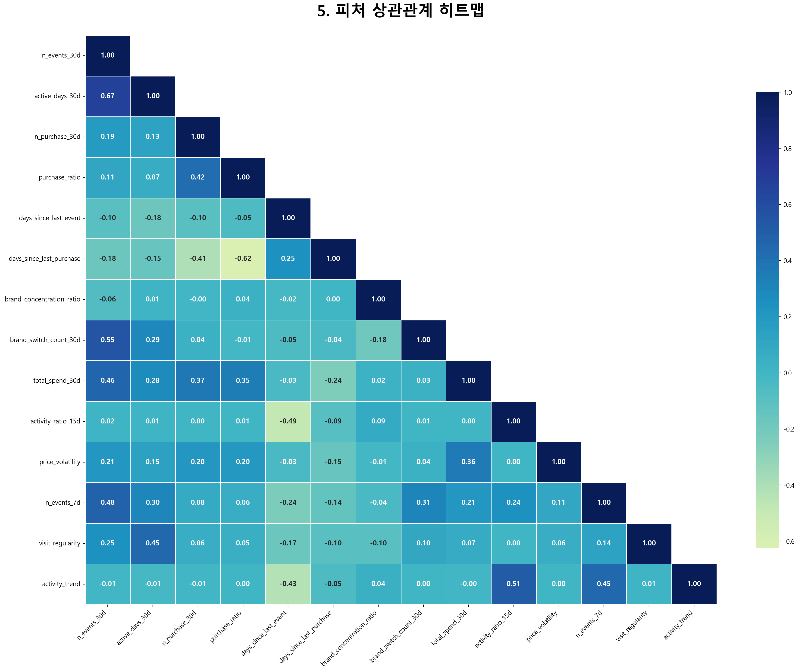</div> | <div align="center">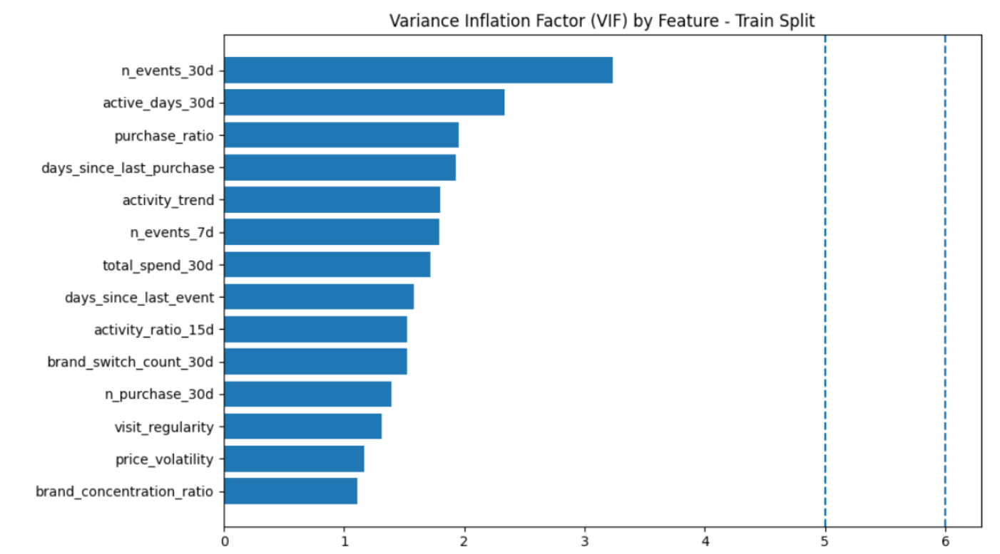</div> |


**6  누수 방지 규칙(필수)**
- 스케일러/인코더/결측치 대체 등 전처리는 **train에서만 fit**, val/test는 transform만 수행
- 모델 선택/튜닝은 validation까지만 사용하고, test는 최종 1회 평가


<br><br>
# 모델별 성능 비교
## 🧠 모델링 스토리라인 (Baseline → Strong ML → DL -> Strong DL)
1) **Baseline (M1)**  
- 단순/해석 가능한 모델 Logistic Regression로 기준선 확보

2) **Strong ML (M2~M3)**  
- LightGBM / HGB로 성능 상향 및 안정화

3) **Deep Learning (M4~M6)**  
- MLP를 기본버전부터 성능을 세단계까지 향상시킨 버전


**모든 실험은 동일한 Anchor/Label/Time Split을 공유하며**  
**평가 방식(PR-AUC, Precision/Recall/Lift@K)도 동일하게 유지하여 공정 비교한다.**


## Logistic Regression
- 개념 : 선형 분류 모델로, 입력 피처의 가중치(계수)를 통해 어떤 피처가 휴면(m2) 위험을 올리는지 방향성을 해석할 수 있고 학습/추론이 매우 빠릅니다.
  
- 사용 이유 : 가장 단순하고 빠르며, **class_weight="balanced"와 StandardScaler 기반**으로 불균형 이진 분류에서 해석 가능하고 안정적인 기준선을 확보하고, 이후 모델 성능 향상을 비교할 공정한 베이스라인으로 사용했습니다.

- Top-K 타겟팅과의 연결: tune_lr_on_val_topk()에서 Top-K(예: 10%) 기준 Recall/Lift를 직접 최적화하여, “상위 K%만 타겟팅”이라는 운영 목적에 맞춘 기준선을 만들었습니다.

- 필요 자료 -> 모델 평가지표 비교 그래프 및 표 / 대표 코드

## LightGBM
- 개념 : 트리 기반 Gradient Boosting 모델로, 탭 피처에서 비선형 관계/피처 간 상호작용을 잘 포착하며, 실무에서 널리 쓰이는 강력한 모델입니다.
  
- 사용 이유 : 로그 기반 탭 피처에서 **비선형 관계·특성 상호작용을 강하게 학습**하는 대표적인 트리 부스팅 모델로, 불균형 데이터에서도 **class_weight="balanced" + early stopping**으로 안정적으로 성능을 끌어올리기 위해 사용했습니다.

- Top-K 타겟팅과의 연결: tune_lgbm_on_val()에서 Top-K(5%) 기반 Recall/Lift + PR-AUC를 결합한 점수로 하이퍼파라미터를 선택해, “상위 K% 고객 선별” 목적에 직접 최적화했습니다.

- 필요 자료 -> 모델 평가지표 비교 그래프 및 표 / 대표 코드

## HistGradientBoosting
- 개념 : scikit-learn의 히스토그램 기반 Gradient Boosting으로, 데이터가 클 때 학습이 효율적이며 트리 부스팅 계열로 비선형·상호작용을 잘 학습합니다(외부 라이브러리 의존이 적고 재현성이 좋음).
  
- 사용 이유 : LightGBM과 동일한 “트리 부스팅 계열”이지만 구현체가 다르므로, 성능·안정성·운영 편의성(의존성/환경 이슈) 측면에서 대안(backup) 및 비교군으로 적합합니다.  
**sample_weight를 직접 구성해(make_sample_weight) 불균형을 보정**하며, 비교적 단순한 파이프라인으로도 강한 성능을 기대할 수 있어 채택했습니다.

- Top-K 타겟팅과의 연결: 튜닝 목표를 val Recall@Top{BEST_K_PCT}% 우선 + 동률이면 PR-AUC로 두어, “상위 K% 고객을 최대한 놓치지 않는” 운영 목적을 직접 반영했습니다.

- 필요 자료 -> 모델 평가지표 비교 그래프 및 표 / 대표 코드

| Logistic Regression | LightGBM | Histogram Gradient Boosting |
| :--: | :--: | :--: |
| <div align="center">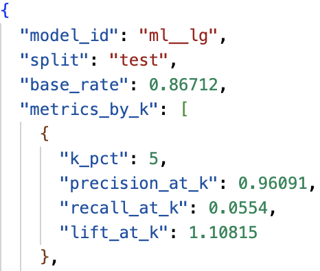</div> | <div align="center">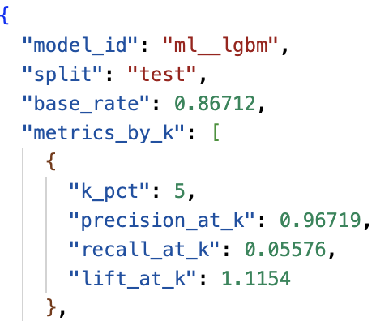</div> | <div align="center">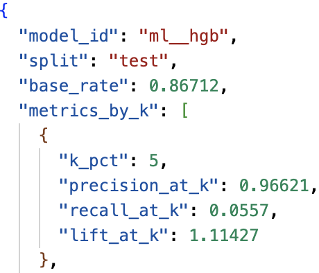</div> |

## MLP
- MLP는 표(탭울러) 피처에서 선형모델이 못 잡는 비선형·상호작용(예: 활동빈도×최근성, 구매0인데 이벤트만 많음 같은 조합)을 학습가능
- 출력이 sigmoid(logit) 확률이므로, 확률을 내림차순 정렬해 상위 K%를 고르는 랭킹 운영(쿠폰/혜택)을 자연스럽게 연결할 수 있다  
  > 휴면이 많아서 단순 정확도보다 “누구를 먼저 잡아야 하는가”가 중요 → 그래서 MLP도 Top-K 지표 중심으로 모델/epoch를 선택하는 구조가 맞다

  ### Base(가장 단순한 2-hidden-layer MLP)
  - 규제(regularization)가 거의 없다(기본 dropout 0, BN 없음)
  - Top-K 타겟팅과 연결 : val Recall@Top5%가 최대인 설정/epoch를 best로 선택(동률이면 PR-AUC)  
    >  base는 “구조는 고정/단순”, 학습 세팅만 가볍게 튜닝한 모델.

  ### Enhance(BatchNorm + Dropout)
  - 학습 안정성 / 과적합 방지 
  → “학습은 잘 되지만, 일반화(과적합) 리스크가 상대적으로 높을 수 있는” 가장 기본형.
  - 사용이유 : 휴면 예측에서 이득이 있는지 기준선 확보 및 모델 복잡도 증가의 효과를 비교하기 위해 사용
  - Top-K 타겟팅과 연결 : val Recall@Top5%가 최대인 설정/epoch를 best로 선택(동률이면 PR-AUC)  
    >  enhance는 “규제와 안정화(=BN+Dropout)”를 구조적으로 추가한 모델.

  ### Advanced(Residual connection)
  - 학습 안정성(기울기 소실 완화) / 탭울러 피처의 조합패턴을 더 정교하게 모델링
  - 사용이유 : 휴면 고객이 압도적으로 많아 모델이 미세한 차이를 ‘랭킹’으로 구분해야 하므로, **표현력(폭 256) + 학습 안정성(Residual+BN)**을 강화한 최종 MLP로 성능 상한을 확인하고 운영 후보로 선택.
  - Top-K 타겟팅과 연결 : 매 epoch마다 val Recall@Top5% / best epoch는 Recall@Top5% 최대(동률이면 PR-AUC)
    > advanced는 “구조를 크게 강화”하고, 학습은 “고정 세팅 + TopK 기준 epoch 선택”으로 단순화한 최종형.


| Base | Advanced | Enhance |
| :--: | :--: | :--: |
| <div align="center">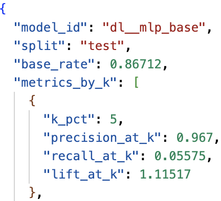</div> | <div align="center"></div> | <div align="center">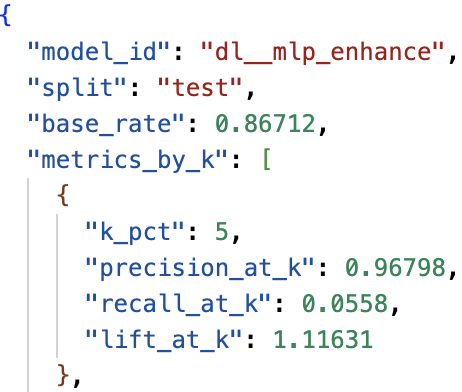</div> |

> ### 가장 좋은 성능을 모델의 결과

| **confusion matrix (Top 5%)** | **PR-AUC Curve** |
| :--: | :--: |
| <div align="center"></div> | <div align="center">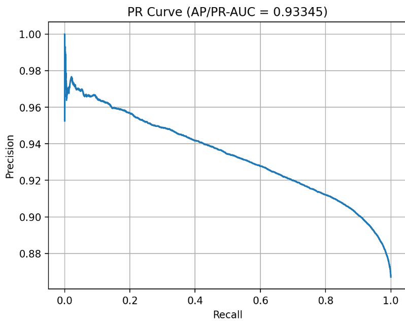</div> |


### ☑️ 시연 영상

| **메인페이지** | **비교 페이지** |
| :---: | :---: |
| 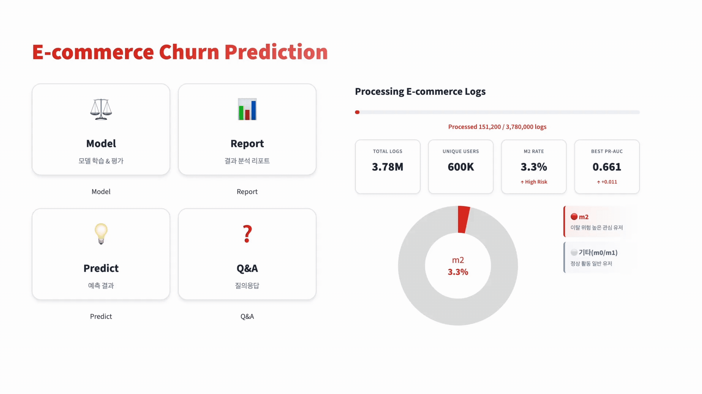</video> | </video> |
| **인사이트 페이지** | **예측 페이지** |
| </video> | </video> |


<br>

## 🛠️ 기술 스택

### 🚀 Languages & Frameworks
 

### 📊 Data Processing & Database
   

### 🤖 AI & Machine Learning
  

### 📈 Visualization
 

### 🛠️ Utilities & Environment
  
 

<br><br>
## Insight

### 1. Risk-Based Differential Couponing (위험도별 차별화 전략)
획일적인 쿠폰 살포는 예산 낭비를 초래합니다. 본 프로젝트는 예측된 이탈 확률(Risk Score)에 따라 타겟을 4단계로 세분화하고, **위험도에 비례하는 최적의 인센티브**를 자동으로 매칭합니다.

- **🔴 Top 5% (Emergency):** 이탈이 확실시되는 구간에는 **30% 슈퍼 쿠폰**을 통해 강력한 Win-back을 시도합니다.
- **🟡 Top 15% (Warning):** 이탈 징후가 보이는 구간에는 **15~20% 할인**으로 가격 경쟁력을 어필합니다.
- **🟢 Top 30% (Potential):** 잠재적 위험군에게는 **10% 할인/무료배송** 등 가벼운 넛지(Nudge)로 리텐션을 유지합니다.

### 2. Actionable Dashboard Workflow
예측 모델을 현업에 즉시 적용할 수 있도록 **진단 → 타겟팅 → 실행**이 한 화면에서 이루어진 대시보드를 구축했습니다.

1. **Targeting:** 슬라이더를 통해 마케팅 가용 예산에 맞춰 **Top-K 타겟 군**을 즉시 추출.
2. **Review:** `Data Editor`를 통해 개별 고객의 위험도를 확인하고 발송 대상에서 제외/추가하는 **Human-in-the-loop** 프로세스 지원.
3. **Execution:** 설정된 전략에 따라 버튼 클릭 한 번으로 쿠폰 발송 및 캠페인 실행 완료.

### 3. Automated Insight Generation
모델이 예측한 결과(`risk_score`)를 바탕으로, 해당 유저가 왜 위험한지 설명하는 **자동 진단 리포트**를 생성합니다.
- *ex) "최근 30일간 활동 일수 3일 이하", "구매 전환율 급감" 등 구체적 사유 명시*


<br><br><br>

# 🚀 Troubleshooting

본 프로젝트 수행 과정에서 직면한 핵심 기술적 난관과, 이를 해결하기 위해 적용한 엔지니어링적 의사결정 및 개선 사항을 정리했습니다.

## 1. 데이터 불균형과 모델 성능 개선
> <strong>"모든 유저를 '이탈'로 예측하는 엉터리 모델을 어떻게 고쳤는가?"</strong>

- <strong>문제 상황 (Problem)</strong>
  이탈 유저가 <strong>81%</strong>나 되다 보니, 모델이 그냥 <strong>"전부 이탈"</strong>이라고 찍어도 정확도가 높게 나오는 문제가 있었습니다. 정작 우리가 찾아야 할 타겟 유저는 하나도 못 찾는 상태였습니다.

- <strong>해결 전략 (Solution)</strong>
  1. <strong>평가 기준 변경 (Top 5% 타겟팅)</strong>: 단순 정확도 대신, 마케팅 예산이 집행될 <strong>상위 5% 유저를 얼마나 잘 맞추는지(Precision)</strong>를 핵심 지표로 바꿨습니다.
  2. <strong>Model Architecture Pivot</strong>: 단일 모델의 한계를 넘기 위해 여러 특성을 동시에 고려할 수 있는 <strong>Wide & Deep 구조</strong>를 도입했습니다. (※ 인위적인 데이터 뻥튀기 방식은 사용하지 않았습니다.)

- <strong>성과 (Impact)</strong>
  <strong>Top 5% Precision</strong>을 최우선으로 최적화한 결과, 무작위로 타겟팅할 때보다 <strong>선별력(Lift)이 1.16배 이상</strong> 좋아져 가장 성능이 좋은 모델이 되었습니다.

---

## 2. 학습 불안정성 & 하이퍼파라미터 최적화
> <strong>"수동으로 설정하던 방식에서 어떻게 최적값을 확정했는가?"</strong>

- <strong>문제 상황 (Problem)</strong>
  초기에는 히든 레이어 수나 학습률(Learning Rate) 같은 <strong>하이퍼파라미터(Hyperparameter)</strong>를 사람이 직접 입력했습니다. 그러다 보니 학습 도중 <strong>Loss가 `NaN`으로 발산</strong>하거나, 최적의 조합을 찾기 위해 수십 번씩 코드를 수정하고 재실행해야 하는 비효율이 발생했습니다.

- <strong>해결 전략 (Solution)</strong>

  **Step 1: Optuna를 이용한 자동 탐색 (Search Phase)**
  최적화 프레임워크인 **Optuna**를 도입하여, 광범위한 파라미터 공간(Search Space)에서 최적의 조합을 자동으로 찾았습니다. 이때 **Batch Normalization**을 추가하여 `NaN` 발산 문제를 해결했습니다.

<br>


## ✏️ 한 줄 회고
<table style="width: 100%; border-collapse: collapse; text-align: center;">
  <thead>
    <tr style="background-color: #f2f2f2; border-bottom: 2px solid #ddd;">
      <th style="width: 20%; padding: 12px; border: 1px solid #ddd;">이름</th>
      <th style="width: 80%; padding: 12px; border: 1px solid #ddd;">한 줄 회고</th>
    </tr>
  </thead>
  <tbody>
    <tr>
      <td style="padding: 12px; border: 1px solid #ddd; font-weight: bold; word-break: keep-all;">정석원</td>
      <td style="padding: 12px; text-align: left; border: 1px solid #ddd; color: #888;">처음 접하는 분야에서 팀장을 맡아 부담도 컸지만, 팀원들이 끝까지 함께해 준 덕분에 무사히 프로젝트를 마무리할 수 있었습니다.</td>
    </tr>
    <tr>
      <td style="padding: 12px; border: 1px solid #ddd; font-weight: bold; word-break: keep-all;">김다빈</td>
      <td style="padding: 12px; text-align: left; border: 1px solid #ddd; color: #888;">이번 프로젝트를 돌이켜보면 여러 방면으로 성장할 수 있었던 계기가 됐습니다. 모두가 모델 성능 조금이라도 더 높여보겠다고 다 같이 잠 줄여가며 일했는데, 결과도 너무 만족스러웠던 것 같고 무엇보다 과정이 너무 즐거웠습니다. 유능하고 재미있는 팀원들과 만나서 너무너무 좋았습니다.</td>
    </tr>
    <tr>
      <td style="padding: 12px; border: 1px solid #ddd; font-weight: bold; word-break: keep-all;">김지우</td>
      <td style="padding: 12px; text-align: left; border: 1px solid #ddd; color: #888;">처음 프로젝트를 시작할 때만 해도 제 머릿속에는 오직 좋은 모델을 찾아 성능을 높게 만들어야겠다는 생각뿐이었습니다. 하지만 실제 데이터는 저에게 높은 정확도가 전부는 아니라는 것을 알려주었습니다. 데이터 분석의 핵심은 단순히 정답을 맞히는 것이 아닌 우리가 찾아내야될 목적을 정의하는 과정에 있다는 것을 알게 되었으며 평가 기준을 여러번 바꾸고 나서야 데이터 속에 숨어있던 실직적인 이탈 고객들이 데이터 또한 볼 수 있었습니다. 수많은 데이터를 어떻게 사용하여 결과를 도출해야될지 막막했었 것은 무색하게도 프로젝트를 끝마친 지금은 프로젝트를 통해 많은 것을 배웠던 것 같습니다.</td>
    </tr>
    <tr>
      <td style="padding: 12px; border: 1px solid #ddd; font-weight: bold; word-break: keep-all;">송주엽</td>
      <td style="padding: 12px; text-align: left; border: 1px solid #ddd; color: #888;">누수 없는 앵커·라벨 규칙을 끝까지 지키면서, m2 타겟을 Top-K 지표로 검증하고 모델·지표·UI까지 한 번에 배포 가능한 형태로 완성한 팀 프로젝트.</td>
    </tr>
    <tr>
      <td style="padding: 12px; border: 1px solid #ddd; font-weight: bold; word-break: keep-all;">신승훈</td>
      <td style="padding: 12px; text-align: left; border: 1px solid #ddd; color: #888;"> 이번 프로젝트를 진행하며 아직 부족한 점이 많다는 것을 느꼈지만, 실제 활용을 고려해 문제를 바라보는 경험을 할 수 있었습니다. 또한, 훌륭한 팀원들과 함께 고민하고 의견을 나누며 많은 것을 배울 수 있었습니다.</td>
    </tr>
  </tbody>
</table>
